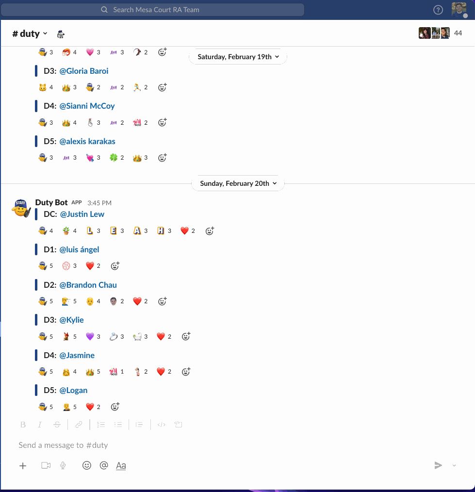
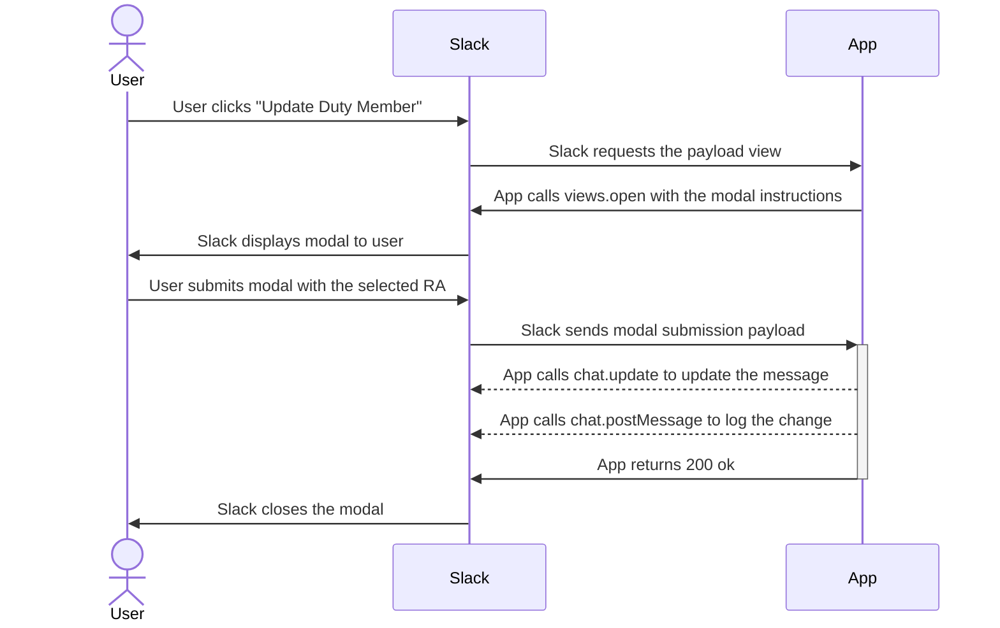

# Duty Bot Updater
Duty Bot Updater is an interactive Slack component that lets any Slack user updat​e the schedule posted by Duty Bot.

### User Work Flow
1. User clicks "More actions" for a message
2. User clicks "Update Duty Member"
3. User selects another Slack user
4. Orginal message is updated  

### App Flow 

## Setup

### Create a Slack app

1. Create an app at https://api.slack.com/apps
2. Navigate to the OAuth & Permissions page and add the following bot token scopes:
    * `commands` (required for Actions)
    * `chat:write` (required to send messages as a bot user)
    * `im:write` (required to open a DM channel between your bot and a user)
3. Click 'Save Changes' and install the app

​
### Run locally 
1. Get the code
    * `git clone git@github.com:ChaseC99/duty-bot-updater.git`
    * `npm install`

2. Set the following environment variables to `.env` with your API credentials (see `.env.sample`):
    * `SLACK_ACCESS_TOKEN`: Your app's bot token, `xoxb-` token (available on the Install App page, after you install the app to a workspace once.)
    * `SLACK_SIGNING_SECRET`: Your app's Signing Secret (available on the **Basic Information** page)to a workspace)  
    * `LOG_CHANNEL`: The channel id for where your log messages will go.

3. If you're running the app locally:
    1. Start the app (`npm start`)
    1. In another window, start ngrok on the same port as your webserver (`ngrok http 3000`)
​

### Configure with Slack
1. Go back to the app settings and click on **Interactive Components**.
2. Click "Enable Interactive Components" button:
    * Request URL: Your ngrok URL + `/updateDutyMessage` in the end (e.g. `https://example.ngrok.io/updateDutyMessage`)
    * Under **Actions**, click "Create New Action" button
      * Action Name: `Update Duty Member`
      * Description: `Updates the message to display the correct Duty Member`
      * Callback ID: `update_duty_member`
3. Click Save
​

## Deploying to AWS  
I could have just used `serverless` to create these resources and deploy but I wanted to get the experience of setting up and deploying my code manually.

### Setting up AWS resources
- Create a new Lambda function with a Node runtime environment
    - You may need to extend the timeout to 15 seconds
- Add an API Gateway trigger to the lambda function
- Update your Slack app's interactive component request url to be the url from the API Gateway.

### Updating the deployment
- Run `source build_deployment.sh`
- Upload the new `deployment-package.zip` file to the Lambda function